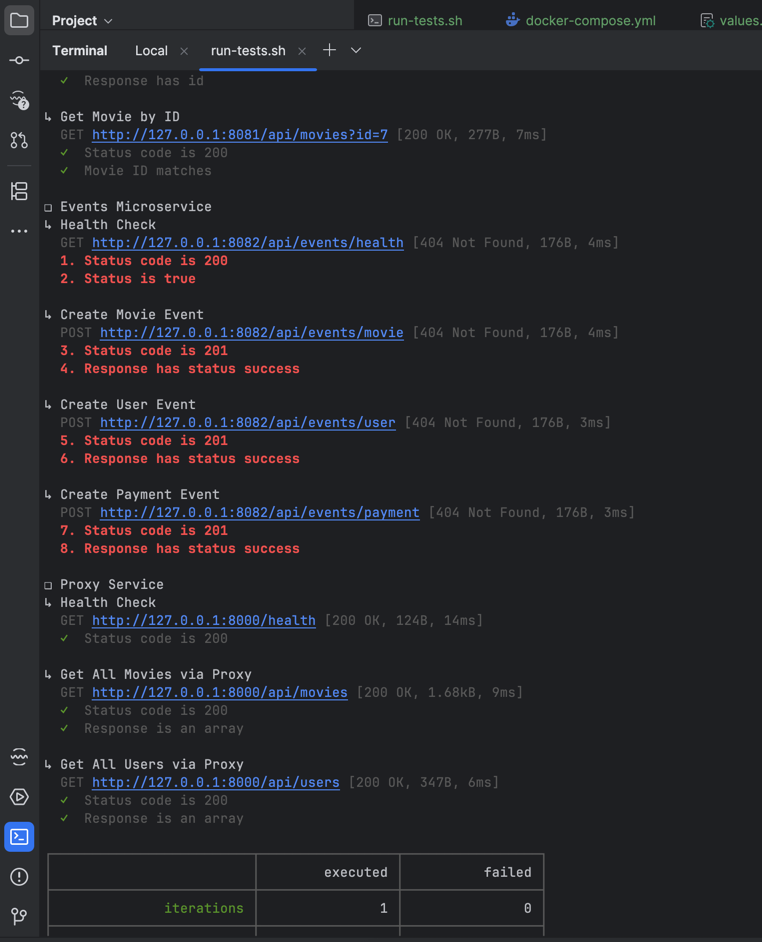
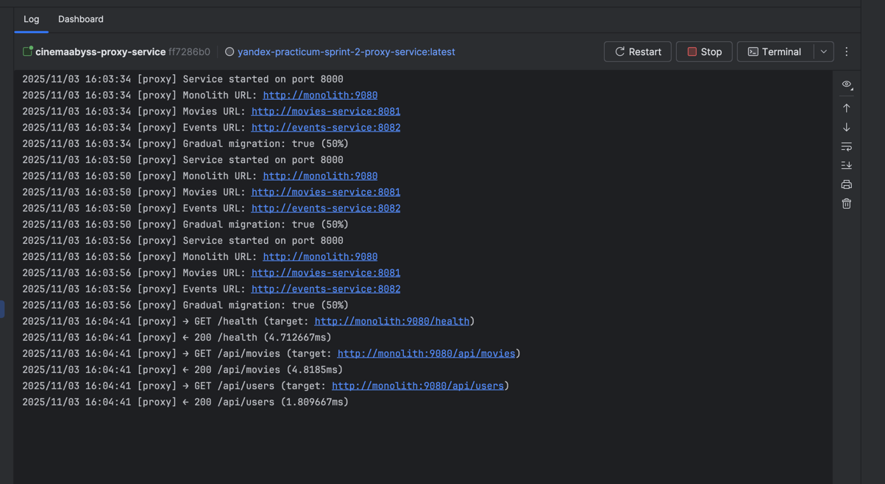
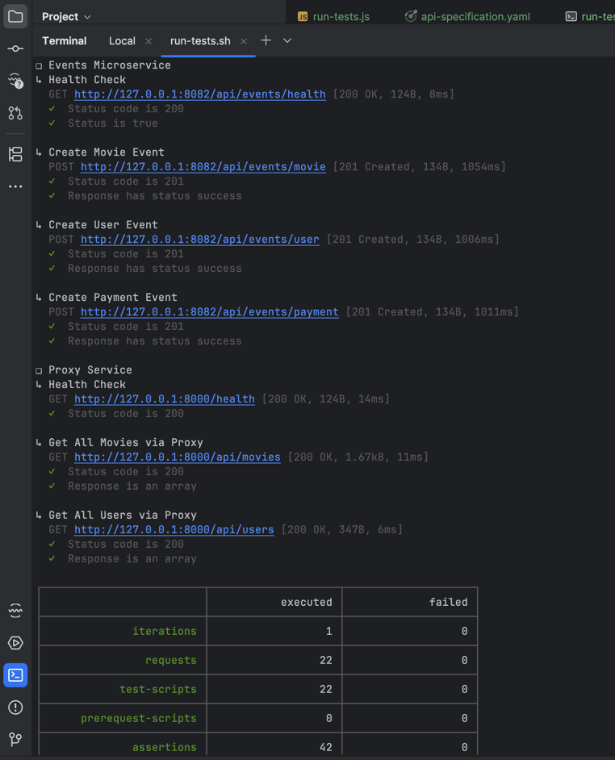
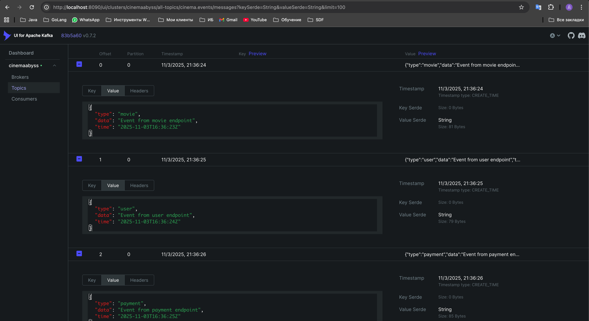
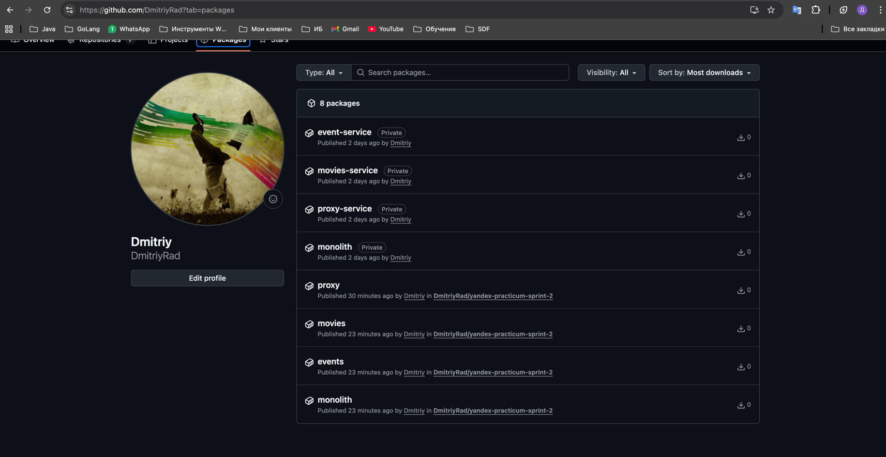
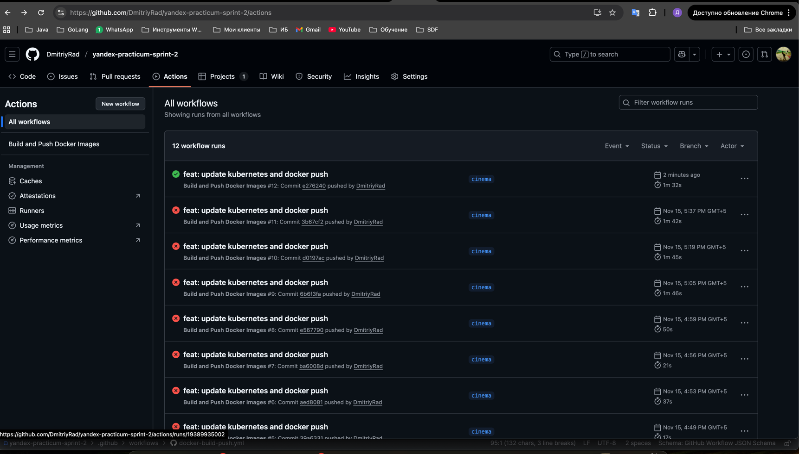
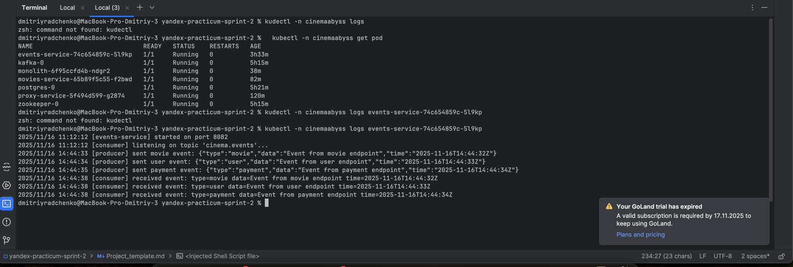
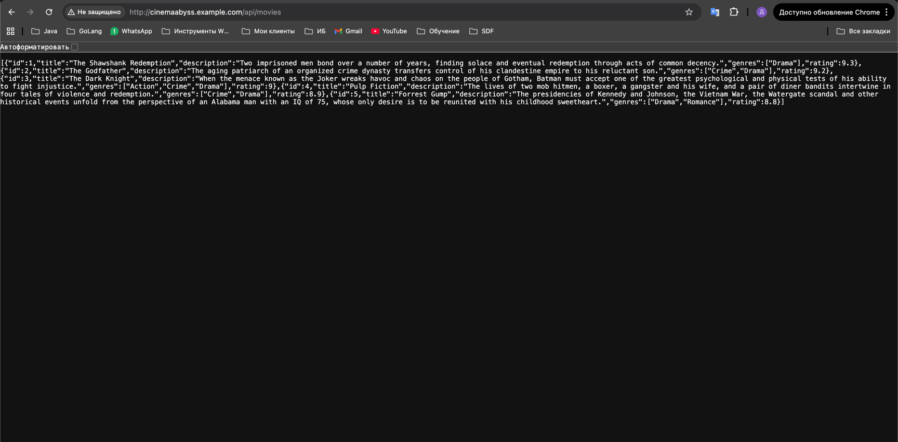
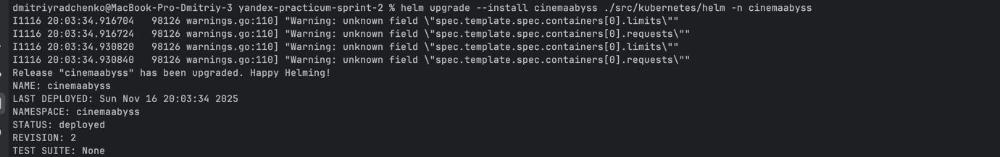
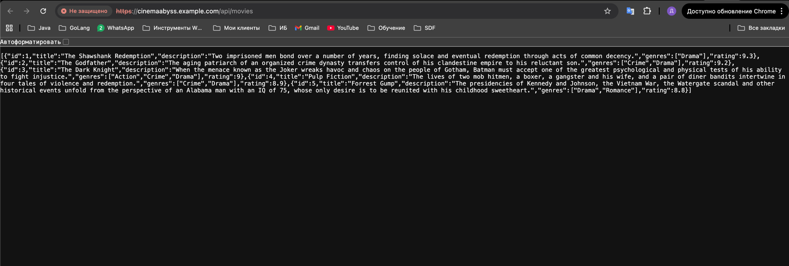

## Решение проектной работы 2 спринта

# Задание 1

### После анализа текущего состояния системы и структуры проекта мной была спроектирована целевая архитектура (to-be) 
### платформы «КиноБездна». Архитектура была логически разделена на домены и оформлена в виде контейнерной диаграммы уровня C4.

## Основные слои:

1. Клиентский слой
   •	Web / Mobile / Smart TV (React, Swift, Kotlin)
   •	Работают через API Gateway
   •	Предоставляют пользователю:
   •	Каталог фильмов
   •	Персональные рекомендации
   •	Управление подписками

2. API Gateway
   •	Используются Kong / NGINX
   •	Центральная точка входа
   •	Маршрутизация REST/gRPC/WebSocket
   •	Интеграция с Auth Service
   •	Балансировка нагрузки

3. Бизнес-сервисы (Go)
   •	Auth Service — JWT, авторизация
   •	User Service — профили пользователей, просмотренная история
   •	Metadata Service — метаданные фильмов
   •	Video Catalog Service — каталог и источники контента
   •	Subscription Service — оплаты, подписки, тарифы
   •	Все сервисы:
   •	изолированы
   •	общаются по REST/gRPC
   •	публикуют события в Kafka

4. Интеграции и аналитика
   •	Kafka Cluster
   •	Recommendation Engine (ML), потребляющий события из Kafka

5. Хранилища данных

Каждый сервис использует собственную БД PostgreSQL:
•	users-db
•	metadata-db
•	billing-db

6. DevOps и Observability
   •	CI/CD на GitHub Actions / GitLab CI
   •	Развёртывание Helm / ArgoCD
   •	Мониторинг: Prometheus + Grafana
   •	Логи: ELK Stack

Диаграмма контейнеров разработана 
### -> [Диаграмма контейнеров](./docs/diagrams/container/Kinobezdna_C4_Containers.puml)

# Задание 2

### 1. Proxy
1.1.  Proxy сервис (Strangler Fig)
Я реализовал прокси-сервис на Go для постепенной миграции функциональности movies из монолита в микросервис.
Выполнено:
•	Реализован паттерн Strangler Fig
•	Настроен фиче-флаг для переключения трафика между монолитом и сервисом movies
•	Подключен к API Gateway
•	В монолите изменён порт с 8080 → 9080
•	Написаны модульные тесты (успешные)
•	Скриншоты логов и тестов приложены

Тесты 
Лог прокси сервиса 
В монолите сменил порт с 8080 на 9080

### 2. Kafka

Реализован микросервис на Go (event-service) для работы с Kafka.
Выполнено:
•	Продусер/консьюмер
•	Работа с топиками
•	Успешные автоматические тесты
•	Скриншоты Kafka UI и тестов

# Задание 3

3.1. CI/CD для Proxy сервиса
   •	Настроена автоматическая сборка образов через GitHub Actions Workflows
   •	Артефакты публикуются в GitHub Container Registry (GHCR)
   •	Скриншоты сборок приложены

### Proxy в Kubernetes

Были подготовлены и обновлены следующие файлы:
•	event-service.yaml
•	monolith.yaml
•	movies-service.yaml
•	proxy-service.yaml

Выполнено:
•	Добавлены переменные окружения
•	Настроены Deployment + Service
•	Добавлен feature flag для прокси
•	Настроен доступ к GHCR (docker login + secret)

Задача выполнена ниже прилагаю скриншоты 

# Задание 4

Для дальнейшей автоматизации и удобства развёртывания мной был подготовлен Helm chart для proxy-сервиса.

Выполнено:

1. Подготовка Helm chart
   •	Создана структура чарта
   •	Настроены values.yaml
   •	Параметризованы:
   •	image.tag
   •	feature flag
   •	Gateway routing
   •	сервис и ingress

2. Деплой

